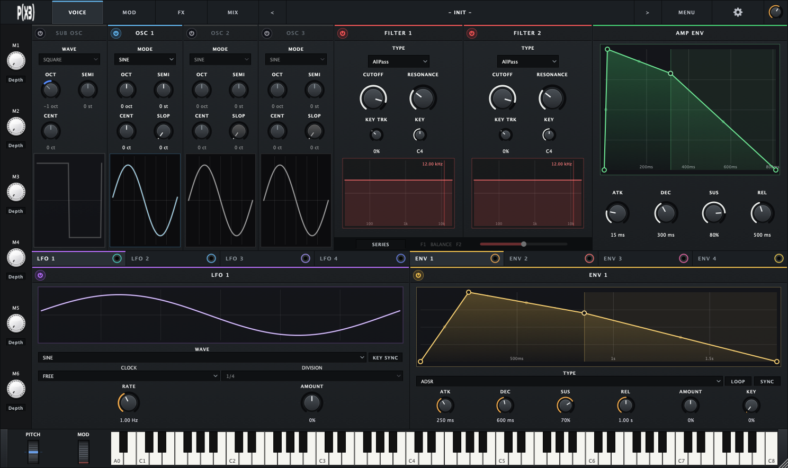

# P(X3)

P(X3) is nine macOS plug-ins built from one codebase.

**PX3 Synth** is a 64-voice polyphonic JUCE synthesizer: four sources per voice,
two filters, drawable envelopes, a modulation patch bay, six Macros, a
channel-style mixer with bus inserts, and a full effects rack.

**Eight of its effects also ship on their own** — PX3 Delay, Mood, Chorus,
Spread, Reverb, Doom, Lucy and Vibe — as AU and VST3. They
are not ports: each drives the same shared DSP object the Synth drives, through
the same interface. See
[docs/ECOSYSTEM_ARCHITECTURE.md](docs/ECOSYSTEM_ARCHITECTURE.md).



*PX3 Synth's VOICE page at its default 1488 × 884 window size.*

This README is an overview for new users and a function-level map for
developers. Day-to-day operating detail lives in the user manual.

Current version: v0.8.4 (the single source is `PX3_VERSION` in `CMakeLists.txt`).

| For | See |
| --- | --- |
| Playing it: every page and control, Macros, MIDI Learn, walkthroughs | [docs/USER_MANUAL.md](docs/USER_MANUAL.md) |
| What changed in the 0.8 rebuild | [docs/RELEASE_NOTES_0.8.0.md](docs/RELEASE_NOTES_0.8.0.md) |
| Build, install, release packaging | [docs/BUILDING.md](docs/BUILDING.md) |
| Architecture, maintenance map, test modes | [DEVELOPMENT.md](DEVELOPMENT.md) |
| CI, releases and signing | [docs/CI_CD.md](docs/CI_CD.md) |
| Preset format and storage | [docs/PRESETS.md](docs/PRESETS.md) |
| Modulation and filter routing | [docs/MODULATION_AND_FILTER_ROUTING.md](docs/MODULATION_AND_FILTER_ROUTING.md) |

The shipped factory presets are defined in
`products/PX3Synth/Preset/FactoryPresets.cpp`.

## Start Here

**Playing it?** [docs/USER_MANUAL.md](docs/USER_MANUAL.md) — quick start, every
control, the Macro and MIDI systems, sound design walkthroughs, troubleshooting
and a glossary.

**Building or changing it?** Carry on below.

## What You Get

- 64-voice poly synth engine.
- **One window.** Four pages — **VOICE**, **MOD**, **FX** and **MIX** — plus
  SETTINGS behind the gear. No feature opens a window of its own. The default
  size is 1488 × 884, resizable from 1100 × 700 to 2400 × 1400.
- **Four sources per voice:** a sub oscillator and OSC 1-3, each oscillator with
  19 modes (classic, experimental and PX3's own) whose three PARAM knobs change
  meaning by mode, plus COARSE / SEMI / FINE tuning and SLOP (per-voice analog
  drift up to ±12 cents).
- A band-limited **WAVETABLE** mode with eight factory tables, audio and image
  import, a user library, and a GPU-rendered 3D wavetable display.
- **Two filters per voice**, in SERIES or PARALLEL with a BALANCE between them:
  14 types including SVF, ladder, Curtis-style and ARP-style models and a COMB
  filter, with keyboard tracking.
- **AMP ENV** (always an ADSR) and **ENV 1-4**, each either an ADSR or a drawn
  breakpoint envelope of up to 16 points with a curve on every segment.
  Envelope times run to 40 seconds.
- **LFO 1-4**: sine, triangle, saw, square, one-shot RAMP UP / RAMP DOWN,
  sample-and-hold and smooth random, with free, tempo and transport clocks and
  KEY SYNC.
- **A modulation patch bay.** Drag from a source jack — LFO 1-4, ENV 1-4,
  M1-M6 — onto any knob to make a route. Up to 64 routes, each with depth,
  polarity and curve, listed and edited on the MOD page. Envelope routes into a
  voice are evaluated per voice. AMP ENV's ADSR is itself a destination.
- **Six Macros** (M1-M6) down the left of every page, each able to move any
  number of parameters, with a depth panel per Macro.
- **MIDI Learn** on any knob: Shift-click, move a hardware control.
- **Effects:** DRIVE, CHORUS, DOOM, DELAY, MOOD and REVERB in a
  user-ordered send chain; VIBE on the whole instrument ahead of the mixer's
  dry/send split; LUCY and SPREAD on the master; and ANALOG, per-voice drift
  inside the voices.
- **Mixer:** level, pan, send, mute, solo and a meter per channel (SUB, OSC 1-3,
  FX return), and EQ / COMP bus inserts on the dry and FX buses — a four-band EQ
  with a playable graph and an 1176-style FET compressor with a VU meter.
- Clickable 88-key keyboard (A0-C8) with PITCH and MOD wheels.
- One stereo output carrying the whole mix (no multi-output variant).
- A preset bar with a browser, search and filters, and a SAVE / DON'T SAVE /
  CANCEL prompt before a preset switch would discard unsaved edits.
- In-plugin updates: checked, downloaded and verified while your DAW stays open.
- **Eight standalone effect plug-ins** — PX3 Delay, Mood, Chorus, Spread,
  Reverb, Doom, Lucy and Vibe — AU and VST3, selectable in the installer.

## Requirements

- macOS on Apple Silicon (`arm64` only; Intel Macs are not supported)
- Xcode Command Line Tools
- CMake 3.22+
- Ninja (`brew install ninja`)

JUCE is fetched automatically through CMake FetchContent.

## Build And Run

Working on one product, build just that one:

```bash
scripts/build-product.sh --list          # what there is to build
scripts/build-product.sh lucy --vst3     # the quickest loop
scripts/build-product.sh synth --run     # build, then launch the standalone
```

Without `--no-install`, a successful build lands in `~/Library/Audio/Plug-Ins`.
The script reads the product list from `CMakeLists.txt`, so a product added
with `px3_add_product` is buildable immediately.

Everything at once:

```bash
git clone <your-repo-url>
cd px3-synth
cmake -B build -G Ninja
cmake --build build
./scripts/run-standalone.sh
```

`run-standalone.sh` takes `--build [true|false]` to force a clean rebuild
before launching (no value means true) and `--debug true|false` to reconfigure
with the in-plugin debug panel on or off; they combine.

Build artifacts:

- Standalone: `build/PX3Synth_artefacts/Standalone/PX3 Synth.app`
- VST3: `build/PX3Synth_artefacts/VST3/PX3 Synth.vst3`
- AU: `build/PX3Synth_artefacts/AU/PX3 Synth.component`
- Each effect under `build/PX3<Name>_artefacts/` (AU and VST3 only)

## Testing

CMake also configures the developer executables — `PX3Tests` (the component
regression suite), `PX3Diag` (audio diagnostics), `PX3SmokeTest`, `PX3Bench` and
`PX3MemBench`:

```bash
cmake -B build/diag -G Ninja -DCMAKE_BUILD_TYPE=RelWithDebInfo
cmake --build build/diag --target PX3Tests PX3Diag PX3Bench

build/diag/PX3Tests_artefacts/RelWithDebInfo/PX3Tests            # every suite
build/diag/PX3Tests_artefacts/RelWithDebInfo/PX3Tests modmatrix  # one suite
build/diag/PX3Diag_artefacts/RelWithDebInfo/PX3Diag regress      # audio-artifact cases
build/diag/PX3Diag_artefacts/RelWithDebInfo/PX3Diag rtsafety     # allocations on the audio thread
```

`PX3Tests` takes one optional suite name; with none it runs them all. Suites
include `osc`, `filters`, `lfo`, `modenv`, `ampenv`, `modmatrix`, `macro`,
`midimapping`, `fxchain`, `chorus`, `delay`, `mood`, `reverb`, `doom`, `lucy`,
`spread`, `vibe`, `analogdrift`, `preset`, `factorypresets`, `releaseqa`,
`editor`, `editorlayout`, `dense`, `visual`, `updater`, `ecosystem`,
`fxproducts` and `uninstaller` — the full list is at the bottom of
`tests/Tests/TestsMain.cpp`.

Check the exit code, not just the output: a crashed run prints no failure line.
CI (`.github/workflows/ci.yml`) builds every product and gates on `PX3Tests`,
`PX3Diag regress`, `PX3Diag rtsafety`, `PX3SmokeTest` and a bundle check. See
[docs/CI_CD.md](docs/CI_CD.md), and the Testing And Measurement section of
[DEVELOPMENT.md](DEVELOPMENT.md) for what each mode reports.

## Uninstall And Logic Rescan

Remove installed P(X3) plugin bundles and related app/plugin data:

```bash
./scripts/uninstall-local.sh
```

Trigger Logic Pro relaunch helper after cleanup:

```bash
./scripts/uninstall-local.sh --logic-rescan
```

Notes:

- It removes **every** product in the `px3_add_product` table — the Synth and
  all its standalone effects — reading that table rather than carrying its own
  list.
- It targets both user and system plugin folders and cache paths. System-wide
  removals may require `sudo`.
- This is a **developer-machine reset**: unlike the shipped uninstaller it takes
  the whole `~/Library/P(X3)/` preset library without asking. Use the shipped
  `PX3 Uninstaller.app` if you want to be asked.

## Building a Release Installer

Run:

```bash
./scripts/build-release.sh
```

This builds the release plugin formats and creates two native macOS packages: an
installer and an uninstaller. Flags: `--sign` (and `--sign-identity`),
`--notarize` / `--notary-profile` (both imply `--sign`), `--debug true|false`
and `--no-uninstaller`. Developer ID installer signing is applied when
`DEVELOPER_ID_INSTALLER` is set. Full detail: [docs/BUILDING.md](docs/BUILDING.md).

### Installer

The installer presents an **Installation Type** step offering the Synth's three
formats and then the standalone effects under a heading of their own.
Everything is selected by default; you opt *out* of what you do not want.

| Component | Destination | |
| --- | --- | --- |
| Audio Unit (AU) | `/Library/Audio/Plug-Ins/Components/` | optional |
| VST3 | `/Library/Audio/Plug-Ins/VST3/` | optional |
| Standalone application | `/Applications/` | **required** |
| PX3 Delay, Mood, Chorus, Spread, Reverb, Doom, Lucy, Vibe | both plug-in folders above | optional |

The standalone is listed but its checkbox is ticked and disabled, because the
updater helper lives inside `PX3 Synth.app`. A plug-in stages an installer and
hands it to that helper, which is what waits for the host to quit — so without
the standalone, **Prepare Update succeeds and Install cannot work**. It is shown
rather than installed silently so that what lands on the machine is still
visible.

One component package per **effect** rather than per format — that is the choice
a user actually makes — so each carries that effect's AU and VST3 together.
`build-release.sh` reads the product list from `CMakeLists.txt`, so a new
product is packaged without editing the installer, and the finished package is
expanded and checked to confirm each effect's package is both present and
referenced by the Distribution. `productbuild` silently drops a package nothing
selects, which is how the branding resources were lost once before.

Example output artifact:

- `dist/PX3-v<version>.pkg`

### Uninstaller

An uninstaller **application** is generated on every release build:

- `dist/PX3 Uninstaller.app`

It is deliberately an application rather than a `.pkg`. The macOS Installer
always shows install-style UI — a Destination Select pane, an Installation Type
pane and an "Install" button — and none of that can be relabelled from a
Distribution file, so an uninstaller shipped as a package reads as an installer
whatever the panes say. Owning the app means owning every word the user sees,
and it gets the system's own authorisation prompt instead of an installer's.

It is also not versioned. It scans the machine for what is actually installed
rather than working from a list baked in when it was built, so it removes
products released after it shipped and installs left over from releases before
it. A product it has not heard of is listed all the same.

It asks two questions, then acts on the answers:

1. **Which products.** Everything found is ticked to begin with; untick what
   should stay. Removing PX3 Mood leaves PX3 Synth working.
2. **What happens to the presets.** *Keep My Presets* — the default — keeps
   your own saved presets and any wavetables you imported, and removes what a
   reinstall puts back: factory presets, settings and staged updates. *Remove
   Everything* deletes the shared `~/Library/P(X3)/` directory entire, and the
   confirmation says so in those words. Either way the shared directory is only
   touched once no PX3 product is left installed.

For each selected product, **across every user account on the machine**:

- AU and VST3 plug-ins, from both system and per-user plug-in folders
- The standalone application, for products that have one
- Preferences, caches, logs and crash reports
- Installer receipts, so a later install is not skipped as already-present

Audio Unit caches are cleared at the end, so removed plug-ins disappear from
host plug-in lists rather than lingering as broken entries. A log of everything
removed is written to `/tmp/px3-uninstall.log`.

The removal is shell (`scripts/installer/px3-uninstall.sh`) and is tested by
being run against a fixture tree standing in for a real machine — see
`tests/Tests/TestsUninstaller.cpp` and section 7 of
[docs/ECOSYSTEM_ARCHITECTURE.md](docs/ECOSYSTEM_ARCHITECTURE.md).

For a developer-machine uninstall that does not involve a package, use
`./scripts/uninstall-local.sh` instead.

### App icon

The application and plug-in icon is generated from
`products/PX3Synth/Assets/px3.gif`. The wordmark is rotated 45 degrees onto the
diagonal so it fills the square without being cropped, and the rest of the tile
uses the logo's own background colour. See `docs/BUILDING.md` to regenerate it.

### Supported DAWs and hosts

P(X3) ships as an Audio Unit, VST3 and a standalone application, so it loads in
any host supporting those formats. The installer and uninstaller additionally
recognise the following Audio Unit hosts by bundle identifier, and will ask you
to close them before installing or removing the plug-in:

| Host | Host |
| --- | --- |
| Logic Pro | Reason |
| GarageBand | LUNA |
| MainStage | Ardour |
| Ableton Live | Waveform |
| Pro Tools | Renoise |
| Cubase | Maschine |
| Nuendo | AU Lab |
| Studio One | Gig Performer |
| REAPER | Vienna Ensemble Pro |
| Bitwig Studio | Plogue Bidule |
| FL Studio | Digital Performer |

The list lives in `scripts/installer/au-hosts.tsv` and is the only place host
identifiers are defined. Adding a host is a one-line edit there.

Samplitude and Sequoia are Windows-only products and so have no macOS bundle
identifier to match.

### Running-host check

Both the installer and the uninstaller refuse to run while one of the hosts
above, or the P(X3) standalone, is open. A host with the plug-in loaded holds
the bundle open, so replacing or removing it underneath leaves that host running
stale code.

Applications are identified by **bundle identifier**, read from each running
application's own `Info.plist` - not by process name. Ordinary audio software
(Spotify, browsers, QuickTime, conferencing apps) and macOS audio services
(`coreaudiod`, `AudioComponentRegistrar`, `auval`) do not trigger it.

The check runs twice: once when the installer opens, and again immediately
before the plug-in is written or removed, so a DAW opened while the installer
sits waiting is still caught.

### Installer branding

Both packages show the P(X3) logo in the bottom-left corner of the Installer
window. The image is taken from `products/PX3Synth/Assets/px3-installer.png` if
present, otherwise generated at build time from
`products/PX3Synth/Assets/px3.gif` (converted to PNG and scaled, since the
Installer renders a still image). If neither exists the packages simply build
without a background.

## The Window

The top bar holds the page buttons, the preset bar (name, `<` / `>` to step
through the library, MENU for saving and the browser) and the gear for
SETTINGS. The Macro strip runs down the left edge and the keyboard and wheels
along the bottom on every page.

| Page | Contents |
| --- | --- |
| **VOICE** | SUB and OSC 1-3, the two filters and AMP ENV side by side; below them two tabbed panels, LFO 1-4 and ENV 1-4, each source's patch jack on its tab |
| **MOD** | Every modulation route with its depth, polarity, curve and delete, beside a searchable destination browser |
| **FX** | The effect cards in three sections laid out as the signal flows - INSTRUMENT (ANALOG, VIBE), SEND FX (the reorderable FX bus chain, with the bus SEND) and MASTER (LUCY, SPREAD) |
| **MIX** | Channel strips for SUB, OSC 1-3 and the FX return, and the EQ / COMP bus inserts |

The keyboard also carries notices — Macro and MIDI Learn prompts, and a message
when every source is switched off. The page-by-page reference is in the
[user manual](docs/USER_MANUAL.md).

### Modulation

A route is made by dragging from a source jack onto a knob; the knob then wears
a coloured ring showing where its value is going. Routing is entirely the patch
bay's job — the per-card ASSIGN menus of earlier versions are gone. Design and
arithmetic: [docs/MODULATION_AND_FILTER_ROUTING.md](docs/MODULATION_AND_FILTER_ROUTING.md)
and [docs/PX3_0.8.0_MODULATION_UI.md](docs/PX3_0.8.0_MODULATION_UI.md).

Automation and modulation are kept apart:

- Automation, MIDI Learn and the knobs set a parameter's **base** value — what
  the host lane and the knob show.
- LFOs, envelopes and Macros add an offset at DSP time; the effective value is
  base plus modulation, clamped to the parameter's range. The plugin never
  writes effective values back to the host, so automation stays deterministic.

### Macros and MIDI Learn

- **Assign a Macro:** Cmd-click (or double-click) a Macro knob, click the knobs
  it should drive — on any page — then click the Macro again or press Escape. A
  Macro adds to its destinations the way an LFO does; at zero, every destination
  sits exactly where its own knob says. Each Macro's depth panel lists its
  assignments with an amount and a remove button.
- **MIDI Learn:** Shift-click one or more knobs, then move a hardware control.
  Shift-click a mapped knob to drop its mapping. Macros are MIDI-learnable like
  any other knob, so one hardware knob can drive one Macro driving a dozen
  parameters.
- **What is saved:** presets and DAW sessions carry Macro assignments and
  values, and MIDI assignments. A preset with no MIDI assignments leaves yours
  alone; mappings are per plugin instance.

Full behaviour: the manual's Macros and MIDI Learn chapters, and the design
notes in [docs/macro-system-design.md](docs/macro-system-design.md) and
[docs/midi-mapping-design.md](docs/midi-mapping-design.md).

### Effects

The FX page is a scrolling rack in three sections, top to bottom in the order
the signal meets them: **INSTRUMENT** (ANALOG per voice, then VIBE on the whole
instrument), **SEND FX** (the FX bus: DRIVE, CHORUS, DOOM, DELAY, MOOD, REVERB in
series, wrapping onto further rows without changing order, ending in FX BUS EQ /
COMP and the FX RETURN) and **MASTER** (LUCY then SPREAD on the finished mix).
Only the send cards reorder: drag one by the ⋮⋮ handle on its tab. The SEND FX
header carries the one bus send, **SEND → FX BUS** (`mix.send.fx.level`, a master
trim over the per-source sends on the MIX page). Each card's power button is its bypass, and bypassing clears the effect's
buffers (after its fade, so the bypass never clicks), so re-enabling starts
clean rather than releasing an old tail.

| Effect | What it is | Standalone | Design notes |
| --- | --- | --- | --- |
| **ANALOG** | Per-voice analog drift, saturation, supply sag and hiss, inside each voice before the sources are summed. STYLE and AMOUNT. INSTRUMENT section, fixed | — | — |
| **VIBE** | A Uni-Vibe model: four staggered phase stages swept by one lamp through four photocells, CHORUS / VIBRATO modes, STEREO LINKED / INVERTED. On the instrument ahead of the dry/send split (one pedal, dry and send); INSTRUMENT section, fixed | PX3 Vibe | [VIBE_DSP_DESIGN.md](docs/VIBE_DSP_DESIGN.md) |
| **DRIVE** | SOFT / HARD / ASYM clipping with TIGHT, TONE and automatic level matching, oversampled with anti-derivative anti-aliasing | — | — |
| **CHORUS** | Hardware topologies: JUNO-60 I / II / I+II, Dimension D (DIM 1-4, 1+4, 2+4, 3+4), BOSS CE-1 and a Solina-style ENSEMBLE | PX3 Chorus | [CHORUS_DSP_DESIGN.md](docs/CHORUS_DSP_DESIGN.md) |
| **DOOM** | Two-channel ambient processor: an always-listening micro-looper (BURST / RADIO / MASK) and a wet channel (SOUP / RELAY / FLIP); six knobs, twelve functions | PX3 Doom | [DOOM_DSP_DESIGN.md](docs/DOOM_DSP_DESIGN.md) |
| **LUCY** | Spectral degradation built on a masking coder: low-bitrate artifacts, packet loss, spectral freeze and jitter. A master insert on the whole mix, before SPREAD; MASTER section, fixed | PX3 Lucy | [LUCY_DSP_DESIGN.md](docs/LUCY_DSP_DESIGN.md) |
| **DELAY** | Seven algorithms — Granular, Tape, Analog/BBD, Ping-Pong, Stereo, Modulated, Diffusion — with tempo sync; FEEDBACK sets a decay time | PX3 Delay | — |
| **MOOD** | Micro-looper (ENV / TAPE / STRETCH) and wet channel (REVERB / DELAY / SLIP) tied together by CLOCK, the engine's sample rate | PX3 Mood | [MOOD_DSP_DESIGN.md](docs/MOOD_DSP_DESIGN.md) |
| **REVERB** | Six algorithmic types - ROOM (image-source reflections), PLATE (Dattorro), HALL (16-line FDN), CLOUD (with octave-up SHIMMER), SPRING (dispersive chirps) and GATED - each with its own presets | PX3 Reverb | [REVERB_DSP_DESIGN.md](docs/REVERB_DSP_DESIGN.md) |
| **SPREAD** | Mono-compatible widening by allpass decorrelation, on the master bus after everything else | PX3 Spread | [STEREO_SPREAD_DSP_DESIGN.md](docs/STEREO_SPREAD_DSP_DESIGN.md) |

Mood, Doom and Lucy are inspired by Chase Bliss pedals (behaviour only, no code);
credits are in `THIRD_PARTY_NOTICES.md`.

## Settings

The gear at the right of the top bar opens SETTINGS. It is a toggle - pressing
it again, or CLOSE at the bottom of the page, returns to the page you came from.

- **Enable animations** (on by default) gates the keyboard and wheel animations
  and the logo movement. It is a global install preference rather than
  per-instance state: changing it in one open plugin window changes it in all of
  them, it is kept in `~/Library/P(X3)/settings.xml`, and it is never written
  into a preset or a project.
- **Console Engine** selects the console profile applied to the whole output -
  CLEAN, BRITISH, AMERICAN, TRANSFORMER or MODERN. Its parameters show in a host
  as Console Enabled and Console Profile, to keep them apart from the ANALOG
  card. This one IS part of the sound: it is automatable and
  travels in sessions and presets. Design:
  [docs/ANALOG_ENGINE_ARCHITECTURE.md](docs/ANALOG_ENGINE_ARCHITECTURE.md).
- **UPDATES** shows the installed version and checks for, downloads and installs
  updates.

### Updates

When an update is waiting, the editor asks once per DAW session (or standalone
launch) with an UPDATE / CANCEL prompt; UPDATE opens SETTINGS. The updater
ignores a release until a complete installer is attached to it, so a release
still being built by CI is never offered. The installer is downloaded and
verified in the background; the `PX3 Updater` helper inside `PX3 Synth.app`
installs it once the host quits. Code: `shared/Infrastructure/Update/`.

## Presets And State

- Presets are `.px3preset` files in the shared `~/Library/P(X3)/` library;
  factory presets are installed there automatically. INIT is the default state
  rather than a preset and cannot be overwritten. Format: [docs/PRESETS.md](docs/PRESETS.md).
- Plugin state carries every parameter, the drawn envelope shapes, modulation
  routes, Macro assignments, MIDI mappings and the FX order.
- Saving an unedited project reproduces it exactly, so hosts do not mark a
  reopened project as changed.
- **Compatibility:** 0.8 rebuilt the parameter set, 0.8.2 added LFO 4 and
  ENV 4, and this version removes the Separate FX Output setting along with the
  second output pair. Sessions and user presets saved by any earlier version,
  0.8.x included, do not load; the schema fingerprint check rejects them. The
  factory library is rebuilt from code, so it always loads.

## Signal Flow (High Level)

```text
MIDI / on-screen keyboard
  -> Voice (per note): SUB, OSC1, OSC2, OSC3
       -> ANALOG (per-voice drift, before the sources are summed)
       -> FILTER 1 / FILTER 2 (SERIES or PARALLEL)
       -> AMP ENV
  -> Source stems -> channel level/pan/mute/solo -> dry sum
                  -> channel sends                -> send sum
  -> VIBE (one Uni-Vibe on the dry sum and the send sum: one lamp, clips on their total)
  -> DRY BUS (fader/pan/mute/solo, EQ/COMP)
  -> FX chain on the send (user order: DRIVE / CHORUS / DOOM / DELAY / MOOD / REVERB)
  -> FX RETURN (return level/pan/mute/solo)
  -> MASTER BUS (DRY + FX RETURN, fixed output boost)
  -> console master -> LUCY -> SPREAD -> output ceiling -> output
```

Important routing rules:

- LFOs and envelopes are modulation sources only and are never mixed into any
  audio bus.
- The send is pre-pan; mute kills a channel's send as well as its dry signal.
- The plug-in has one stereo output bus (the separate FX pair was removed after 0.8.3); the
  master stages always reach it.
- LUCY's wet path is ~17 ms late (816 samples at 48 kHz; ~28 ms in SLOW) and
  is not reported to the host as latency.

Bus architecture notes:

- Voice rendering exports explicit stems for SUB/OSC1/OSC2/OSC3.
- DRY BUS is the post-channel-gate reference signal.
- FX send path is independent per source and can be gated by solo state.
- FX BUS stores return-only contribution relative to the sent signal.
- MASTER BUS is the final sum.

## Mixer Gain Structure

- Every source (SUB, OSC1, OSC2, OSC3) and the FX return defaults to -4 dB, giving
  each channel headroom for modulation without the mix clipping.
- That trim lives **on the sources themselves**, not inside the fader. A mixer
  fader at unity means unity: what the strip shows is the channel's actual gain.
- Because the trim is a default rather than a hidden offset, presets and DAW
  sessions store and restore whatever the fader was actually set to. Loading a
  preset never re-applies the default over the top of a saved value.
- The fader range extends above unity by the same 4 dB, so a channel can still be
  pushed back to its full pre-trim level.
- The trim value and the fader's maximum come from one shared constant
  (`kSourceHeadroomDb` in `products/PX3Synth/DSP/PluginProcessorInternals.h`), so
  the source side and the fader range cannot drift apart.

## Mixer Solo Rules

Mixer solo behavior is intentionally explicit:

- If no solo buttons are engaged, all unmuted source channels feed DRY and FX normally.
- If one or more source solos (SUB/OSC1/OSC2/OSC3) are engaged, only soloed sources are audible in the DRY path.
- During source-solo mode, FX path only passes when FX solo is also engaged.
- During source-solo + FX-solo mode, only soloed sources feed FX sends.
- FX return mute always hard-mutes the FX return channel.

## Diagnostics

Beyond the test suites, `PX3Tests` and `PX3Diag` carry diagnostic modes that
measure things a pass/fail assertion cannot:

| command | what it measures |
|---|---|
| `PX3Tests glcheck` | whether the GPU renderer draws, by reading pixels back |
| `PX3Tests envcheck` | the wavetable environment, off against on |
| `PX3Tests sharpcheck` | waveform line sharpness, by edge profile in physical pixels |
| `PX3Tests attackpop` | the note onset - first samples, largest step, signal against the envelope |
| `PX3Tests uisnapshot <dir> <w> <h>` | renders the editor on every page to PNGs |
| `PX3Diag regress` | the audio-artifact regression cases CI gates on |
| `PX3Diag rtsafety` | allocations inside `processBlock`, with a backtrace at the first |
| `PX3Diag memory` | per-object and per-voice memory |

There is also an in-process onset capture for faults that only appear in a real
host. Set `PX3_ONSET_CAPTURE` to a file path and the first note-on records 8192
samples of the final output, the amp envelope of the voice that took the note,
its attack setting, how far into the note its envelope believes it is, and the
sounding voice count:

```bash
PX3_ONSET_CAPTURE=/tmp/onset.tsv "…/PX3 Synth.app/Contents/MacOS/PX3 Synth"
```

It allocates nothing unless the variable is set, and the file is written on the
message thread.

## Debug Mode

The in-plugin DEBUG panel is controlled at build time and is OFF by default; no
debug button is rendered without it.

```bash
./scripts/build-release.sh --debug true            # release packaging with it
./scripts/run-standalone.sh --debug true           # reconfigure, rebuild, launch
./scripts/run-standalone.sh --debug true --build   # ...with a forced clean rebuild
scripts/build-product.sh synth --debug --run       # single-product build
cmake -B build -G Ninja -DPX3_DEBUG_PANEL=ON       # by hand
```

### Debug bus observability

The detached debug console exposes live internal bus observability:

- Bus RMS readouts for OSCILLATOR, DRY, FX, and MASTER buses.
- FX send/return gain controls for quick wet-path gain-staging checks.

These are developer diagnostics and do not change the preset format.

### Debug performance HUD

When `PX3_DEBUG_PANEL` is enabled, the bottom-left CPU/RAM overlay reports:

- `CPU`: per-instance plugin load measured from this instance's `processBlock`
  execution time relative to block audio duration, smoothed, so very short
  spikes may be visually damped.
- `RAM`: per-instance estimate computed as process resident memory divided by
  active PX3 instance count. It is an estimate, because process memory is shared
  and cannot be partitioned by instance; in a standalone with one instance it
  effectively matches app RSS.

### Developer preset dumping

The debug console includes a `PRESET / STATE TOOLS` block with `Preset Name`
and `Author` (both required), a `Category` dropdown of the categories the
library actually has, and `DUMP PRESET`, disabled until name and author are
filled in.

`DUMP PRESET` opens a native save dialog and writes a normal `.px3preset`
(appending the extension if omitted), through the same serializer as user
presets, validating the structure before writing and reporting the result in
the debug console and event log. Dumped presets are production-compatible, not a
debug-only format, and carry no runtime/debug UI state. It is meant for
collecting presets from beta testers, QA snapshots, state-restore testing and
promoting dumped presets into the factory library.

## UIConfig JSON

Runtime UI styling is loaded from `UIConfig.json`; the source of truth is
`shared/UI/Style/UIConfig.json`. The page layout itself comes from the scene
document `shared/UI/Style/InstrumentScene.json`.

Hot reload behavior:

- The editor checks for file changes during `timerCallback()` and reloads when
  the file modification time changes.
- If JSON parsing fails, the previous valid config remains active.
- UI config load/reload and path-switch events are logged in the debug event log.

Path resolution order:

- Debug builds (`JUCE_DEBUG` or `PX3_DEBUG_PANEL`):
  - `PX3_UI_CONFIG_PATH` (if set and file exists)
  - `./shared/UI/Style/UIConfig.json` from current working directory
  - upward probe for `shared/UI/Style/UIConfig.json`, then `UIConfig.json`
  - bundle fallback: `Contents/UIConfig.json`, then `Contents/Resources/UIConfig.json`
- Non-debug builds:
  - bundle only: `Contents/UIConfig.json`, then `Contents/Resources/UIConfig.json`
  - no source-tree probing

Production packaging:

- CMake copies `shared/UI/Style/UIConfig.json` into `Contents/Resources/UIConfig.json` for Standalone, AU, and VST3 bundles.
- `scripts/build-release.sh` fails fast if AU/VST3 bundles or component pkg payloads are missing `Contents/Resources/UIConfig.json`.

## Internal Function Map (Developer Guide)

This section describes where the major pieces live. [DEVELOPMENT.md](DEVELOPMENT.md)
has the longer "Where Do I Look?" map.

### Repository layout

- `products/PX3Synth/` — the Synth: `DSP/`, `UI/`, `Preset/`, `Assets/`.
- `products/PX3<Effect>/` — each standalone effect: a thin `PluginProcessor`,
  `PluginEditor` and `PluginEntry` around a shared DSP object.
- `shared/DSP/` — every effect's DSP, plus `Filter/` (voice filters and comb),
  `Analog/` (the console engine), `AnalogDrift/` (ANALOG) and `Core/` (STFT,
  oversampler, FET compressor, smoothed gain, output ceiling).
- `shared/Infrastructure/` — `Fx/` (the standalone-effect processor and card
  editor), `Update/` (the updater), `Settings/` (global preferences).
- `shared/UI/` — components, FX cards, styles and the scene/config JSON.
- `tests/Tests/` — `PX3Tests` suites; `tools/` — `PX3Diag`, benchmarks, smoke
  test; `scripts/` — build, install, release and installer scripts.

### Source code organization

`PX3SynthAudioProcessor` remains the single central orchestrator class, but its
implementation is split across multiple files by responsibility:

- `products/PX3Synth/DSP/PluginProcessor.h`
  - Single authoritative class declaration, including the source, Macro and
    voice counts (`kLfoSourceCount`, `kEnvelopeSourceCount`, `kMacroCount`,
    `kPolyphonyVoiceCount`).
- `products/PX3Synth/DSP/PluginProcessor.cpp`
  - Parameter creation, JUCE lifecycle entry points, and `processBlock`.
- `products/PX3Synth/DSP/ParameterCatalog.*`
  - The parameter definitions behind the state schema.
- `products/PX3Synth/DSP/PluginProcessorParameters.cpp`
  - Parameter getters, the modulation destination list, modulation
    application, and the FX order API (`get/setFxProcessingOrder`).
- `products/PX3Synth/DSP/PluginProcessorSource.cpp`
  - Gathers the per-block voice settings, applying modulation at the read
    points.
- `products/PX3Synth/DSP/PluginProcessorMidi.cpp`
  - MIDI + virtual keyboard handling, note activity tracking, pitch/mod wheel
    state bridges.
- `products/PX3Synth/DSP/PluginProcessorState.cpp`
  - State serialization/restoration (`getStateInformation`,
    `setStateInformation`, ValueTree create/apply).
- `products/PX3Synth/DSP/PluginProcessorDebug.cpp`
  - Debug event logging, debug state inspection, and round-trip/restore
    diagnostics used by the debug console.

`PluginProcessorEffects.cpp` is an empty placeholder - the effect
implementations live in the component classes under `shared/DSP/`.

If you are looking for a specific behavior, start with the matching file above,
then follow calls back into `processBlock` in `PluginProcessor.cpp` for the
runtime orchestration path.

### Core processor lifecycle

- `prepareToPlay`
  - Sets sample rate, pushes current settings to voices, prepares the effects.
- `processBlock`
  - Merges MIDI + virtual keyboard MIDI and updates note state for the UI.
  - Computes the block's LFO, Macro and global modulation, and hands each voice
    its per-voice modulation plan.
  - Updates and renders the synth voices.
  - Runs the mixer, the FX chain in its current order, the bus inserts and the
    master stages.

### Modulation core

- `ModulationGraph.h`
  - The typed source → destination graph: scope, polarity (native, unipolar,
    bipolar) and curve per route.
- `VoiceModulation.h`
  - Per-voice evaluation of envelope routes into voice-local destinations
    (filter cutoff and resonance, oscillator fine tune, pitch mod, PARAM A-C
    and wavetable position),
    allocation-free and copied to each voice once per block.
- `ParameterCatalog` / `isGraphDestination`
  - Which float parameters can be modulation destinations.
- `currentLfoSignalForBlock`
  - Generates the current block LFO signal and tracks debug phase/value state.
- `applyModulationToNormalizedValue`
  - Applies normalized base + modulation and clamps to [0, 1].

### Voice + synthesis

- `SynthVoice::renderNextBlock`
  - Per-sample voice render pipeline: pitch bend/mod wheel smoothing, the four
    sources, ANALOG, the filters and the amp envelope.
- `OscillatorUnit` (`OscillatorUnit.*`)
  - `renderSample` / `renderMode` switch across the 19 oscillator modes; the mode
    helpers include `renderSuperSaw`, `renderFormant`, `renderFmCore`,
    `renderHardSync`, `renderOrgan`, `renderDigital`, `renderPhysical`,
    `renderRob` and `renderPx3`.
- `SubOscillator.*`, `Wavetable*.*`, `AmpEnvelope.*`, `BreakpointEnvelope.*`,
  `EnvelopeGenerator.*`, `LfoGenerator.*`
  - The sub oscillator, the wavetable engine and importer, and the envelope and
    LFO generators.
- `shared/DSP/Filter/VoiceFilter.*`
  - The per-voice filter models; `CombResonator.*` is the COMB type.

### FX + ordering

Each FX block is its own component class with the same four-call interface -
`prepare`, `reset`, `updateForBlock`, `processSampleFrame` - so the processor does
not need to know anything about their internals:

- `shared/DSP/Vibe/UniVibe.*`
  - VIBE, the Uni-Vibe model (docs/VIBE_DSP_DESIGN.md). Also PX3 Vibe.
- `shared/DSP/AnalogDrift/AnalogDrift.*`, `AnalogDriftEngine.*`, `AnalogDriftVoiceStage.h`
  - ANALOG's shared per-block state and its per-voice stage. Applied inside
    `SynthVoice`, because ANALOG is a per-voice stage rather than a bus effect.
- `shared/DSP/Distortion/Distortion.*`
  - DRIVE.
- `shared/DSP/Delay/Delay.*`
  - `processDelayAlgorithmSample` switches between the seven algorithms;
    `processIsaacGranularSample` / `spawnIsaacGrain` handle the granular grain
    lifecycle.
- `shared/DSP/Reverb/Reverb.*`
  - `processFdn8` is the shared feedback delay network behind ROOM, HALL and
    CLOUD; the Dattorro plate is separate.
- `shared/DSP/Mood/Mood.*`, `shared/DSP/Doom/Doom.*`
  - `processInternalStep` runs each clock-divided engine. The mode-dependent
    knob meanings live in `MoodControlModel` / `DoomControlModel`, not the DSP.
- `shared/DSP/Lucy/Lucy.*` (`LucyControlModel` for the knob pairs)
- `shared/DSP/Chorus/Chorus.*`, `shared/DSP/StereoSpread/StereoSpread.*`
- `shared/DSP/Analog/AnalogEngine.*`
  - The console engine (Console Engine in SETTINGS).
- `shared/DSP/Core/StftEngine.*` (shared spectral analysis/synthesis)
- `products/PX3Synth/DSP/FxChain.h`
  - Stage ids (permanent; new effects are appended), the default order, and
    the stages that are not reorderable (ANALOG upstream; LUCY, SPREAD on the
    master).
- `getFxProcessingOrder` / `setFxProcessingOrder`
  - Sanitized user order storage and retrieval.

### Editor/UI wiring

The editor (`PX3SynthAudioProcessorEditor`) is split the same way across
`products/PX3Synth/UI/PluginEditor*.cpp` — `Build` (construction and the default
size), `Refresh`, `FxCards`, `MidiMacros` (Macro assign, MIDI Learn and the
update prompt), `ModRouting`, `Presets`, `Paint`, `View`, `Config` and `Debug`.
Pages are their own components (`OscPanel`, `FltPanel`, `AmpPanel`, `ModPanel`,
`FxPanel`, `MixPanel`, `SettingsPanel`), laid out by `UILayout` from the scene
document.

- `refreshOscillatorModeUI`
  - Changes visible PARAM knobs and labels by oscillator mode.
- `refreshFxBypassUI`
  - Syncs bypass states and the disabled look of bypassed cards.
- `FxPanel` + `FxRackCanvas` (`products/PX3Synth/UI/FxPanel.*`, `FxRack.*`)
  - The FX page: three sections built from the `FxChain.h` stage lists, the
    send cards' drag-to-reorder (order is committed to DSP and saved in state),
    and the bus SEND. Layout arithmetic is in `shared/UI/Fx/FxChainLayout.*`.
- `timerCallback` in editor
  - Periodic UI refresh, displays, MIDI status, notices and UIConfig hot reload.

## Troubleshooting

- **No sound:** check that at least one source is switched on (the keyboard says
  so when none is), that MIDI is arriving, and the mixer's mute/solo states.
- **An old session or preset will not load:** state saved before 0.8.2 is
  rejected by design; see Presets And State above.
- **An effect does nothing:** check its power button, and for send effects that
  the source channel's send is up.
- **FX order seems wrong:** the send chain's order is set on the FX page by
  dragging a SEND FX card by its tab; the cards are numbered SEND 1, 2, ... in
  processing order. INSTRUMENT and MASTER cards are fixed.

More in the manual's [Troubleshooting](docs/USER_MANUAL.md#troubleshooting)
section.
